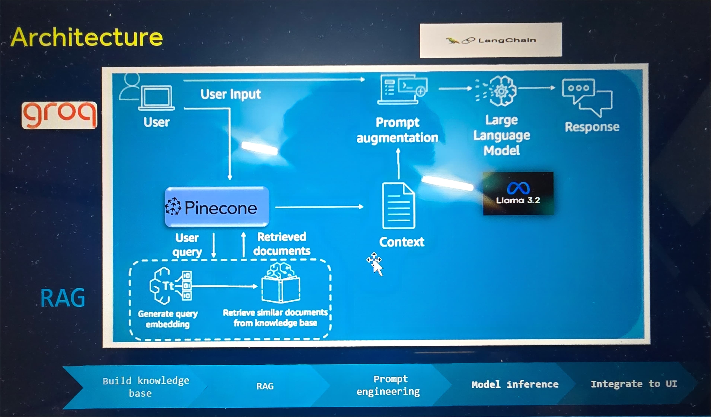

# Personalized Financial Assistant - Project Overview

This project is a personalized financial assistant developed as part of the GenAI Hackathon. It leverages various technologies such as Groq AI, Pinecone, Azure OpenAI, and more to offer tailored financial insights, product recommendations, and spending advice. The assistant helps improve customer retention, engagement, and satisfaction by providing relevant information and proactive suggestions.

### Problem Statement

How can Barclays harness the potential of GenAI to enhance our buisness operations and elevate the experiencce of our customers and colleagues?

### Solution introduction

Bank customer segmentation with AI-Powered solutions involves using data analytics, machine learning and artificial intelligence techniques to categorize customers based on behavior, demographics, preferences, and needs.

1. Behavioural Segmentation with Machine Learning
2. Demographic and Psychographic Segmentation
3. Predictive Segmentation with Supervised Learning
4. Customer Need-Based Segmentation

### Explanation of Each File

- **embed_data_from_pickle.py**: Reads data from a `.pkl` file, generates embeddings using Azure OpenAI API, and stores the embeddings in Pinecone.
- **embed_data.py**: Reads data from a different source and generates embeddings using Azure OpenAI API.
- **embed_jsonl_data.py**: Reads data from a `.jsonl` file, generates embeddings using Azure OpenAI API, and stores the embeddings in Pinecone.
- **llama_inference.py**: Contains functions to initialize the ChatGroq client and generate responses using the ChatGroq model.
- **main.py**: The main entry point for the Flask application. Sets up the Flask server, handles socket connections, and defines API endpoints.
- **package.json**: Contains the dependencies required for the project.
- **pinecone_setup.py**: Contains the function to initialize the Pinecone index.
- **query_bot.py**: Contains functions to generate embeddings using Azure OpenAI API and to generate responses using the ChatGroq model. Integrates with Pinecone to query relevant documents.
- **readme.md**: Provides an overview of the project and instructions on how to run it.
- **static/**: Contains static files for the frontend interface.
    - **css/**: Contains the CSS file for styling the frontend interface.
        - **style.css**: The CSS file for styling the chatbot interface.
    - **index.html**: The HTML file for the chatbot interface.
- **testdata.jsonl**: Contains test data in JSONL format, which is used for generating embeddings and testing the system.
- **user_interface.py**: Contains the function to start the chatbot and handle user interactions.

## How the Project Works

### File Flow

1. **Data Embedding**:
    - **embed_data_from_pickle.py**: Reads data from a `.pkl` file, generates embeddings using Azure OpenAI API, and stores the embeddings in Pinecone.
    - **embed_data.py**: Reads data from a different source and generates embeddings using Azure OpenAI API.
    - **embed_jsonl_data.py**: Reads data from a `.jsonl` file, generates embeddings using Azure OpenAI API, and stores the embeddings in Pinecone.

2. **Query and Response Generation**:
    - **query_bot.py**: Contains functions to generate embeddings using Azure OpenAI API and to generate responses using the ChatGroq model. Integrates with Pinecone to query relevant documents.
    - **llama_inference.py**: Contains functions to initialize the ChatGroq client and generate responses using the ChatGroq model.

3. **Flask Application**:
    - **main.py**: The main entry point for the Flask application. Sets up the Flask server, handles socket connections, and defines API endpoints.
    - **user_interface.py**: Contains the function to start the chatbot and handle user interactions.

4. **Frontend Interface**:
    - **static/index.html**: The HTML file for the chatbot interface.
    - **static/css/style.css**: The CSS file for styling the chatbot interface.

### Preprocessing Steps

1. **Data Loading**:
    - Load data from various sources such as `.pkl` files, JSONL files, etc.

2. **Embedding Generation**:
    - Use Azure OpenAI API to generate embeddings for the loaded data.

3. **Storing Embeddings**:
    - Store the generated embeddings in Pinecone for efficient querying.

### Sample Preprocessed Data

The `testdata.jsonl` file contains sample preprocessed data that can be fed into the system. Here is an example of the data format:

```jsonl
{"prompt": "Hello! I have a transaction to discuss. Here are the details:\n- Transaction ID: T1\n- Customer ID: C5841053\n- Customer DOB: 1994-10-01\n- Customer Gender: F\n- Customer Location: JAMSHEDPUR\n- Customer Account Balance: 17819.05 INR\n- Transaction Date: 02/08/16\n- Transaction Time: 143207\n- Transaction Amount: 25.0 INR\n- Transaction Date (formatted): 1902-08-16\n- Customer DOB Year: 1994.0\n- Today's Date: 2024\n- Customer Age: -0.4476183556009191\n- Transaction Amount: 25.0 INR\n- Transaction Frequency: -0.5834323624554142\n- Average Transaction Amount: -0.2526549283845167 INR\n- Account Balance: -0.1151016805988272 INR"}
```

### Technologies Used
**Groq AI:** Used for generating responses using the ChatGroq model.
**Pinecone:** Used for storing and querying embeddings.
**Azure OpenAI:** Used for generating embeddings.
**Flask:** Used for setting up the backend server.
**Socket.IO:** Used for real-time communication between the frontend and backend.
**HTML/CSS:** Used for creating the frontend interface.

### RAG-Based Approach
This project uses a Retrieval-Augmented Generation (RAG) approach. The RAG model combines the strengths of retrieval-based and generation-based models. It retrieves relevant documents from a knowledge base (using Pinecone) and uses them to generate more accurate and contextually relevant responses (using Groq AI and Azure OpenAI).

### Architecture
The architecture of the project is depicted in the image below. Here is a high-level overview:

**Data Ingestion:** Data is ingested from various sources such as .pkl files and JSONL files.
**Embedding Generation:** Embeddings are generated using Azure OpenAI API.
**Embedding Storage:** The generated embeddings are stored in Pinecone.
**Query Processing:** User queries are processed, and relevant documents are retrieved from Pinecone.
**Response Generation:** Responses are generated using the ChatGroq model, leveraging the retrieved documents for context.
**Frontend Interface:** The user interacts with the chatbot through a web interface, which communicates with the backend via Socket.IO.




### Project Features

- **Customer Segmentation**: Groups customers into segments for personalized recommendations.
- **Anomaly Detection**: Detects outliers in transaction patterns.
- **Churn Prediction**: Predicts churn risk based on recent activity.
- **Proactive Financial Health Notifications**: Provides real-time insights on financial health.
- **Personalized Financial Product Recommendations**: Recommends relevant financial products based on customer profiles.
- **Spending Pattern Analysis and Budgeting Tips**: Analyzes spending patterns and provides budgeting tips.


### Conclusion
This project demonstrates the integration of various technologies to create a personalized financial assistant. By following the steps outlined in this document, you can understand the project structure, preprocessing steps, and how to run the project. The use of Groq AI, Pinecone, and Azure OpenAI ensures efficient and accurate responses, making this assistant a valuable tool for financial insights and recommendations.
